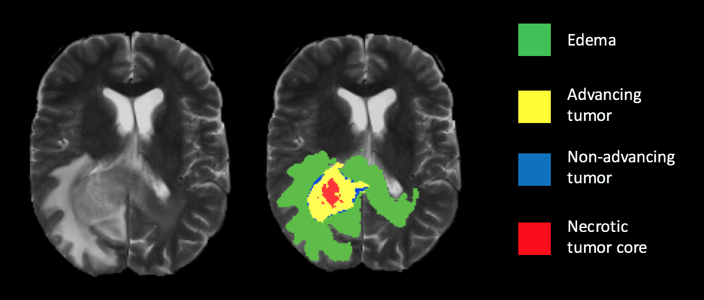
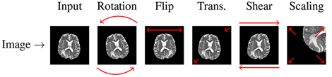
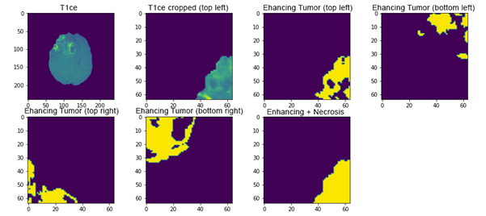
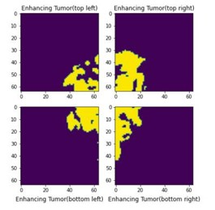
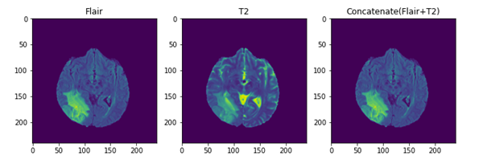
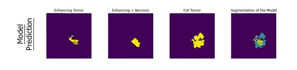
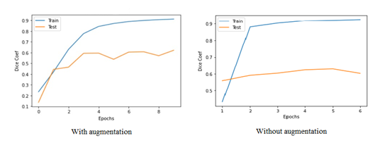
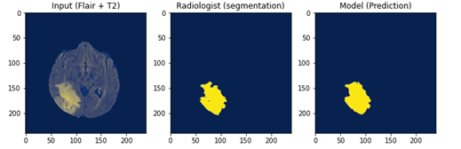
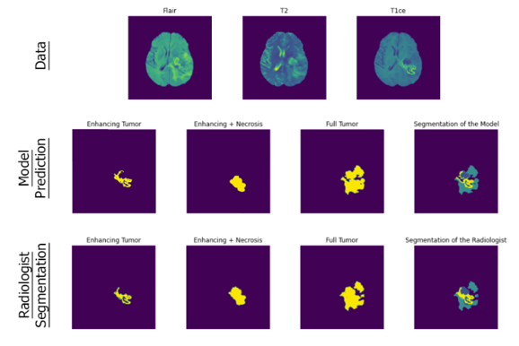

# Tumor Detection and Segmentation

## Abstract
A brain tumor is the growth of abnormal cells that occur in replication during brain cell regeneration. In this project, the U-net deep learning 
architecture, in which an artificial neural network developed for biomedical image segmentation detects the presence of tumor by reading brain MR 
images, enables the classification of tumors as necrosis, edema and contrast-enhancing tumors. As a result, a system that reports the MR image and 
the patient's condition has been developed

 
<b>Figure 1: </b> Label images of brain tumor segmentation  

## Dataset
BraTS data set was used for this study. The training set contains images from 370 patients, including 294 HGG and 76 LGG. There are four sequences 
for each patient's image in dataset : T1, T1ce, T2, and FLAIR. 

The properties of each of these sequences are different from each other. Tag information for segmentation is available in the dataset. Label 0 
segmentation of the radiologist, label 1 full tumor, label 2 necrosis, label 3 non-edema tumor, label 4 enhancing tumor.

## Data Preprocess
Due to the scarcity of MR data, the number of data was increased with the Data Augmentation method. In this study, two separate operations were performed on flair and segment images to segment brain tumors. In segment visuals, all label values are set to the same value. Since there is no tag value in flair images, zero normalization is applied to increase it. The number of samples was increased by applying rotation, horizontal flip and vertical flip to the images. 70 to 130 slices are used for preprocessing. These slices were chosen because the training data is unlikely to have any tumors in the remaining slices of the image. Slices are then normalized to zero mean using the mean and standard deviation. The reproduced data was transformed into an array and the necessary data for training was created. 

  
 <b>Figure 2: </b> Data augmentation operations  
 
While performing tumor segmentation, T1ce images are used to make the parts of the tumor more prominent. When processing these images, the size of the tumor remains very small compared to the overall x-ray size, so the results are not very healthy when making predictions with the model. Therefore, cropping is applied to the part where the tumor is on these images.

By reading the segmentation data, it is known in which pixels the tumor is located. In the X and Y coordinates, by adding the highest and lowest number of data and dividing them into two, there is an approximate midpoint in that coordinate. Trimming is carried out by taking a certain distance from the middle point to both coordinates. A new picture is created with the cropped picture.
Thus, T1C MR images will be given to the model and the model will provide a better learning. Another situation encountered during the modeling phase is that if this tumor data is larger than the 64x64 pixel frame specified earlier, the frame overflows. 

 
<b>Figure 3: </b> Cropped tumors of different types  

The dimensions of frame must match with other frames. For this reason, it is necessary to divide the approximated tumors of known size into a series and give them to the model in this way. Thanks to this procedure, the model will also be trained for tumors larger than the frame found in MR images in T1C.

 
<b>Figure 4: </b> Combined view of the four parts of the tumor  

## Network Architecture
In the study, experiments have been carried out on the model using U-Net network architecture. The aim at this stage is to obtain the optimum result.
The network is based entirely on convolutional neural networks, and its architecture has been extended to work with less educated images and provide more precise segmentation. 
The proposed 9-layer U-net Structure was used for full tumor segmentation. There are four differences between the U-Net architecture used and the original U-Net architecture:
+ Batch normalization layer added after each convolution layer.
+ Used same padding on convolution layers to keep feature map size unchanged.
+ The filter number of the last convolution layer is the same for dual segmentation.
+ Input channels are given in duplicate because T2 and Flair images are used for full tumor segmentation.

## Train
The model was trained by reading the Flair, T2 and Flair+T2 images to be used for the model. The model
The model, which can easily detect full tumors, cannot successfully detect enhancing and necrotic tumor types. This is because they are very small relative to the brain image.

 
<b>Figure 5: </b> Image of flair, t2 and concatenated forms  

For this T1ce images by giving to the model will be provided a better learning. Training continues by gives all these pictures to the model as a series. For the training of the second and third models, the data prepared by applying cropping on the T1ce images will be used. The data divided into two as enhancing and non-edema according to the label 
value is thrown into two arrays defined by cropping and applying threshold. A 7-layered U-Net model is applied for each array, and model training is carried out with the necessary parameters. At the end of the training, 2 more models are created, where the model can make predictions for enhancing and non-edema tumor sections. The weight values resulting from the training are saved to be used in the last segmentation process.
The previously trained model can successfully detect tumors on MR images such as Flair, T2 and generate predictions.  The model, which had difficulties in detecting small tumors in T1ce MR images and produced erroneous results, has been able to detect small tumors successfully thanks to cropping processes.

Tumors were predicted separately from each other. These tumors were combined with the superposition method and a result close to the original tumor image of the patient was obtained.

 
<b>Figure 6: </b> All tumor type predictions of the model  

## Result
Flair and t2-sequence images are used in education to obtain the full tumor. At the end of the training, the model successfully detected the full tumor. Afterwards, the t1ce sequenced images in the dataset were used to detect the enlarged and non-edematous tumor as it strengthens the features of the tumor border and makes the border clear and easily distinguishable. In the model created here, the detection of enlarged and non-edema tumor was also successfully achieved. Finally, segmentation was performed by superimposing the obtained images, and by testing the model, images similar to the segmentation data given in the training data could be obtained.

 
<b>Figure 7: </b> With and without augmentation dice coef compare  
 

|    Table             |    Dice Coef  |    Dice Loss  |
| -------------        |:-------------:|:-------------:|
| With Augmentation    |     0.9128    |     0.0872    |
| Without Augmentation |     0.8725    |     0.1225    |

<b>Table 1: </b> With and without augmentation metrics compare  
 

Shows the model's prediction for full tumor detection. The 9 layers U-Net model was used to obtain the full tumor.

 
<b>Figure 8: </b> Radiologist full tumor detection and model prediction  
 

Shows the model's prediction for tumor segmentation. The 7 layers U-Net model was used to obtain the segmented tumor.

 
<b>Figure 9: </b> Segmentation of the model and radiologist  
 
